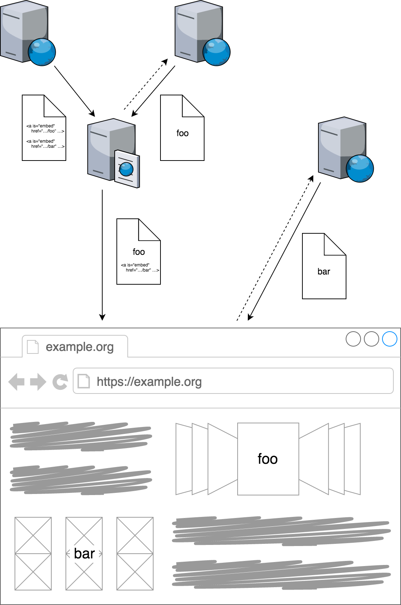

Universal¹ Web Transclusion
===========================

(AKA A{n,rbitrar}y-Side Inclusion)

transcluding HTTP resources server- and/or client-side, with Web Components

    $ npm install
    $ npm start

NB: This is merely a proof of concept at this point.

When the server renders an HTML document, the result is optionally piped through
a transclusion resolver (either within the application or via a proxy) which
attempts to replace any occurrence of `<a is="embeddable-link" href="…" …>` with
the corresponding contents by dereferencing the URI.

The server-side algorithm is fairly straightforward (see `resolver.js`):

1. parse document to next occurrence of `<a is="embeddable-link" href="…" …>`
1. memorize URI as well as (start, end) index
1. request URI (asynchronously)
1. GOTO #1
1. handle response:
    * transclude contents into document at index, replacing the link
    * if there is no positive response (e.g. due to timeout²), continue without
      modifying the document
1. after all responses have been processed³, send the document to the client

When client receives the document, it can attempt to transclude any unresolved
transclusions (e.g. because the respective server-side requests timed out), e.g.
using the custom element provided by `embed.js`, if JavaScript is available —
otherwise
[end users will still able to use the respective links](https://www.gov.uk/service-manual/technology/using-progressive-enhancement),
which might also include fallback content.

----

¹ as in [isomoprhic](http://isomorphic.net)

² optionally determined based on the link's `priority` attribute — which might
  also suppress server-side transclusion, leaving that to the client for the
  respective link

³ this prevents streaming, but could later be optimized
